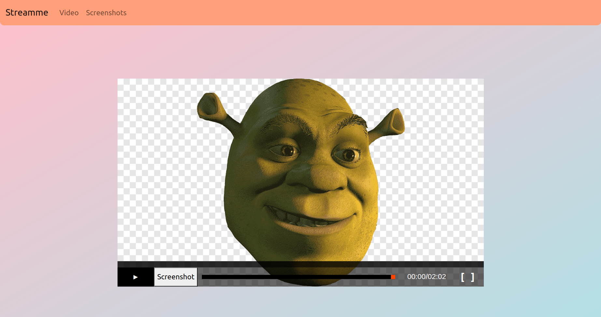
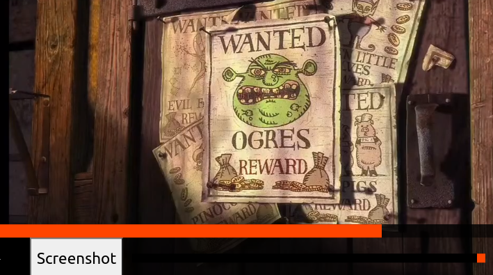
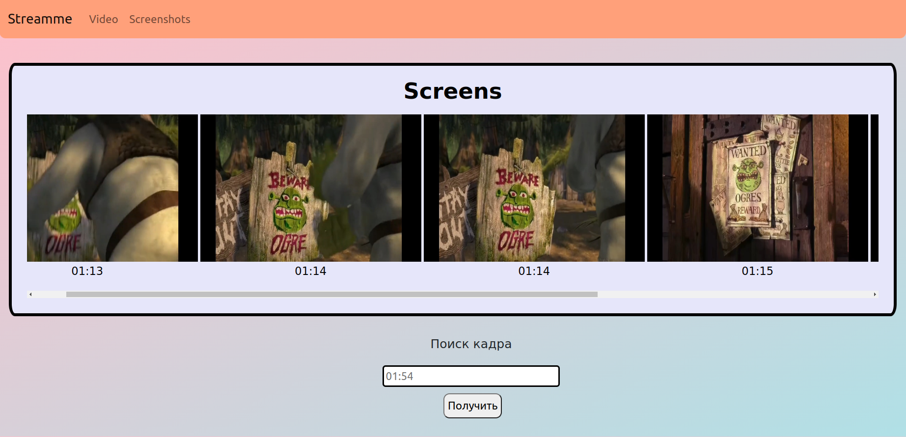
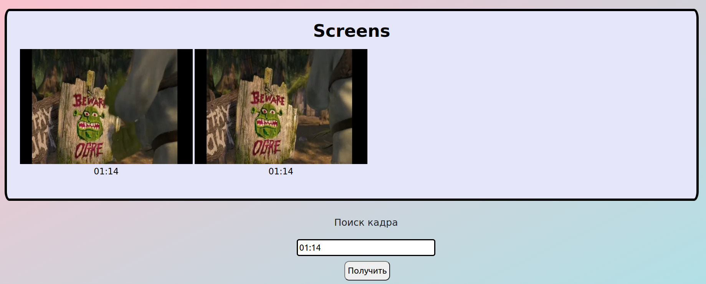

## Streamme

#### *Простой стриминговый веб-сервис с возможностью скриншота экрана*

:black_square_button: Воспроизведение видео в режиме реального времени. \
:heavy_check_mark: Кастомный видеоплеер на HTML5 video. 
Кнопки находятся на самом окне видеоплеера(play/pause, resize, screenshot, sound-bar). \
:heavy_check_mark: Отдельная вкладка с раскадровкой сохраненных кадров и временем. \
:heavy_check_mark: Сохранение кадров в базу данных. \
:heavy_check_mark: Поиск кадра из сохранненной раскадровки. 
Если кадров на одну и ту же секунду несколько -- возвращаются все кадры на эту секунду. \

----

При нажатии на кнопку "Video" на navbar'е(динамический url /video/:video_name) 
появляется сам плеер. Превью видео, в отличие от самого видео-ресурса, захардкожено. 
Запрашиваемое с сервера видео определяется последним сегментом url'а(то есть, здесь: /video/shrek)


----

При событии нажатия пользователем кнопки "Screenshot", будет сделан post-запрос 
с составным содержимым(multipart/form-data) на сервер.
```js
let imageBlob = await new Promise(resolve => canvas.toBlob(resolve, 'image/jpeg'));
let formData = new FormData();
formData.append("image", imageBlob, `${currentTime}.jpeg`);
```
Изображение сохраняются в БД как тип bytea. То есть, сохраняется массив байтов. 
Правильнее будет указывать путь до папки с изображениями(так не будет возникать проблем 
при сохранении изображений большого размера). Однако, я не до конца уверен в том, что методы библиотек
java.io и java.nio, которые я бы использовал для записи и чтения, 
не вносят коррективы в переданный массив байт. Может, например, произойти сжатие при записи. 
Тогда создание ссылки(с помощью `URL.createObjectURL`) на клиентской стороне не увенчается успехом.
Сами изображения сохраняются в базу с помощью ORM.


----

Колесо прокрутки. Изображения запрашиваются с серверной стороны. 



При поиске изображения по таймингу нужно, чтобы введенное значение соответствовало регулярному выражению(Hh:mm:ss).
Иначе, кнопка получения будет недоступна. \
При нажатии на кнопку выборка происходит из уже имеющегося массива элементов. 
Если же строка фильтрации пуста, то происходит запрос на сервер. 
Да, значения приходящие с сервера лучше кэшировать(сейчас это происходит с помощью жизненного хука `watch`), 
либо поменять регулярное выражение(или как-нибудь упростить вообще).


----

### *Почему мне не удалось выполнить первый пункт в списке задач?*

По плану было запрашивать данные с помощью заголовка Range: `Range: bytes=start-end/size`.
Я упорно думал, что получится сделать *так*. Оно и действительно получится: можно грузить файл чанками,
собирать принятые байты в общий массив байт - на выходе получить желаемое. Но проигрывать получаемые порции,
как я заметил, не получится, ведь mp4-контейнер имеет жёсткую структуру(понятное дело).
Я не могу отбросить заголовок, поделить фрейм(и каким образом?) или затереть другую информацию(кодек, метаданные и тд).\
Наверное, стоило писать серверную часть на FastApi(больше гайдов, статей и документации) и WebRTC,
но из-за отсутствия работы с видеопотоком, выбор пал на чаще всего применямый мною инструментарий.

----

*P.S. \
    Это исключительно мои мысли и ощущения. Наверняка, я просто где-нибудь сглупил или перемудрил.*
